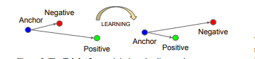

# FaceRecognition

<h3>FaceRecognition implementation using <b>Facenet for verification and Mediapipe for face detection</b></h3>

Note: The model is pretrained model, so no training process is done by me ,the whole architecture and weights are taken from  <a href="https://github.com/serengil/deepface/tree/master"><b>Deepface</b>

<h3>Goal</h3>

The main purpose of this implementation is to build a attendance face recogntion system , this repo is just a simple implementation to get an intuition about how the whole recogntion is working

<h3>For a full End to End Face Recogntion Web Application check here <a href="#">Facewebapp</a></h3>

<h3>1)Face Detection</h3>
<ul> 

   <li>Here, media pipe face detection is used </li>
   
   <li>Model will return bbox and landmark features</li>
   
   <li>Faces from the input image is cropped based on the bbox</li>
   
   <li>Cropped faced are resized based on the size required by the Face Recognition Model</li>
</ul>

<h3>2) Face verification</h3>
<ul>
   <li>Face Net model is used <li>
   
 
FaceNet was proposed by Google Researchers in 2015 in the paper titled FaceNet: A Unified Embedding for Face Recognition and Clustering. It achieved state-of-the-art results in the many benchmark face recognition dataset such as Labeled Faces in the Wild (LFW) and Youtube Face Database.</li>
   
   
 Kindly Check this offical paper <a href="https://arxiv.org/abs/1503.03832">facenet</a>

   
   <li>Model wil return embedding of the image which contained high facial features or pattern which can be used for futher verifiction</li>
   
   <li>Here Model will return vector of size(512) for each image </li>
   
   []
   
   <li><b>Anchor,referance image is verfied against input image</li>
   
   <li>Anchor embedding and input image embedding is calculated</li>
   
 </ul>
 
 
 
 <h3>3) Cosine distance</h3>
 
 
similarity between the two embedding is measured using cosine distance, if the cosine distance is less than the threshold fixed then the both anchor and input image are similiar otherwise not similiar

 
 []
 
 <b>Note: Here the implementation will only count the first detected face in the overall frame</b>
   
   
   
   
   
 
